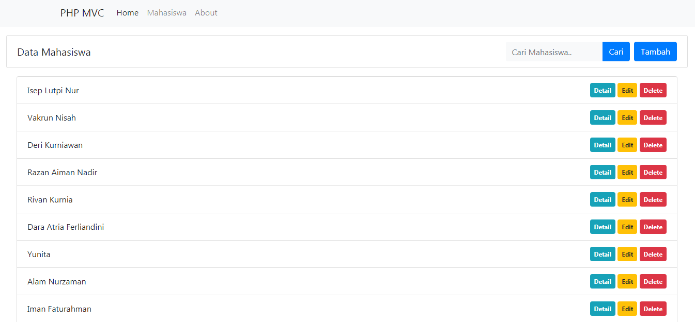

# PHP MVC
Aplikasi ini dibuat dari tutorial [Membuat Aplikasi MVC dengan PHP](https://www.youtube.com/playlist?list=PLFIM0718LjIVEh_d-h5wAjsdv2W4SAtkx) di channel youtube [Web Programing Unpas](https://www.youtube.com/channel/UCkXmLjEr95LVtGuIm3l2dPg)

Cara instalasi:
<pre>
- Impor database
- Buka file: app/config/config.php
- Silahkan sesuaikan konfigurasi:
	define('BASEURL', 'http://localhost/aplikasi/PHP%20MVC/WPU/public');

	// Database
	define('DB_HOST', 'localhost');
	define('DB_USERNAME', 'root');
	define('DB_PASSWORD', '');
	define('DB_NAME', 'wpu_phpdasar');
</pre>

### Tampilan Menu Mahasiswa
